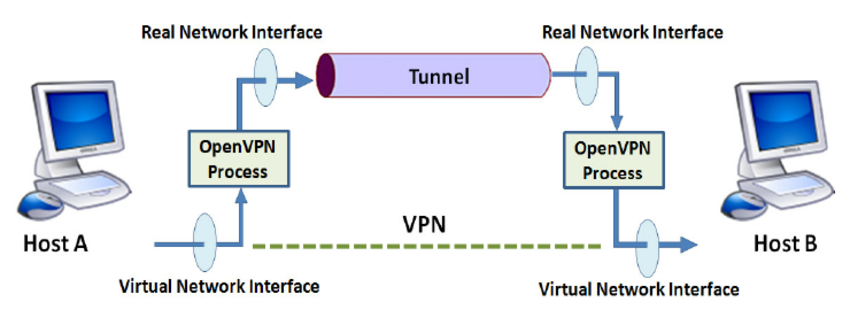

## VPN là gì ?
<font size="5"> 
VPN hay còn gọi là Virtual Private Network (mạng riêng ảo), cho phép người dùng thiết lập mạng riêng ảo với một mạng khác trên Internet. VPN có thể được sử dụng để truy cập các trang web bị hạn chế truy cập về mặt vị trí địa lý, bảo vệ hoạt động duyệt web của bạn khỏi “sự tò mò” trên mạng Wifi công cộng bằng cách thiết lập mạng riêng ảo cho bạn.
</font> 

## Một số dạng VPN

#### Remote Access VPN
Remote Access VPNs cho phép truy cập bất cứ lúc nào bằng Remote, mobile, và các thiết bị truyền thông của nhân viên các chi nhánh kết nối đến tài nguyên mạng của tổ chức.
Remote Access VPN mô tả việc các người dùng ở xa sử dụng các phần mềm VPN để truy cập vào mạng Intranet của công ty thông qua gateway hoặc VPN concentrator (bản chất là một server). Vì lý do này, giải pháp này thường được gọi là **Client to Site**. Trong giải pháp này, các người dùng thường thường sử dụng các công nghệ WAN truyền thống để tạo lại các tunnel về mạng HO của họ.


Dạng này thường áp dụng cho nhân viên làm việc lưu động hay làm việc ở nhà muốn kết nối vào mạng công ty một cách an toàn. Cũng có thể áp dụng cho văn phòng nhỏ ở xa kết nối vào Văn phòng trung tâm của công ty.
Remote Access VPN còn được xem như là dạng Client to Site, cho phép người dùng ở xa dùng phần mềm VPN Client kết nối với VPN Server.

#### VPN Site to Site
Là mô hình dùng để kết nối các hệ thống mạng ở các nơi khác nhau tạo thành một hệ thống mạng thống nhất. Ở loại kết nối này thì việc chứng thực ban đầu phụ thuộc vào thiết bị đầu cuối ở các Site, các thiết bị này hoạt động như Gateway và đây là nơi đặt nhiều chính sách bảo mật nhằm truyền dữ liệu một cách an toàn giữa các Site.


Hoặc từ site có thể kết nối đến nhiều site gọi là site to multiple site bằng việc thiết lập các tunnel  từ server site đi đến các khác


## OpenVPN là gì ?
OpenVPN là một ứng dụng mã nguồn mở cho phép bạn tạo một mạng riêng an toàn qua internet công cộng. OpenVPN triển khai mạng riêng ảo (VPN) để tạo kết nối an toàn. OpenVPN Sử dụng thư viện OpenSSL để cung cấp mã hóa và nó cung cấp một số cơ chế xác thực, chẳng hạn như dựa trên chứng chỉ, khóa chia sẻ trước và xác thực tên người dùng / mật khẩu.

## Hoạt động của OpenVPN
OpenVPN là giải pháp VPN không gian người dùng mã nguồn mở và miễn phí giúp tạo đường dẫn lưu lượng thông qua lớp truyền tải sử dụng giao thức TCP hoặc UDP để đóng gói và truyền dữ liệu. Nó sử dụng giao diện mạng ảo (VNI) để thu thập lưu lượng đến trước khi mã hóa và
gửi lưu lượng đi sau khi giải mã. Bảo mật trong OpenVPN được xử lý bởi OpenSSL
thư viện mật mã cung cấp bảo mật mạnh mẽ qua Lớp cổng bảo mật (SSL) bằng cách sử dụng
các thuật toán tiêu chuẩn như Tiêu chuẩn mã hóa nâng cao (AES),Blowfish, hoặc Triple DES (3DES). OpenVPN sử dụng một chế độ được gọi là Chuỗi khối mật mã (CBC) làm cho
văn bản mật mã của khối hiện tại phụ thuộc vào văn bản mã của khối trước đó. Điều này ngăn cản kẻ tấn công nhìn thấy các mẫu giữa các khối với các thông điệp văn bản rõ ràng giống hệt nhau và thao tác một hoặc nhiều khối này.

VNI xuất hiện dưới dạng giao diện mạng thực tế cho tất cả các ứng dụng và người dùng. Các gói đếnlưu lượng gửi qua VNI được chuyển đến một chương trình không gian người dùng gắn với VNI. Một không gian người dùng chương trình cũng có thể chuyển các gói vào một VNI. Trong trường hợp này, VNI đưa các gói này vào ngăn xếp mạng hệ điều hành để gửi nó đến vị trí được đề cập trong trường địa chỉ đích
của các gói tin. TUN và TAP là mã nguồn mở VNI. TAP mô phỏng thiết bị Ethernet
và nó hoạt động với các gói lớp 2 như khung Ethernet. TUN mô phỏng một mạng
thiết bị lớp và nó hoạt động với các gói lớp 3 như gói IP
## OpenVPN Data Flow
OpenVPN thực hiện những việc sau để bảo mật thông tin liên lạc:



- Nhận các gói lưu lượng đơn giản đi từ chương trình không gian người dùng bằng cách sử dụng
VNI.
- Sau khi nhận được các gói, nó sẽ nén các gói đã nhận bằng cách sử dụng nén Lempel-ZivOberhumer (LZO)
- Sau khi nén, nó mã hóa các gói bằng thư viện mật mã OpenSSL. Đối với
thử nghiệm của chúng tôi mà chúng tôi đang sử dụng AES-128.
- OpenVPN cũng áp dụng phương pháp cửa sổ trượt để cung cấp bảo vệ phát lại.
- Sau đó, nó truyền gói tin bằng giao thức UDP hoặc TCP tới đầu kia.
- Khi nhận được lưu lượng được mã hóa ở đầu kia, OpenVPN thực hiện ngược lại
hoạt động mật mã để xác minh tính toàn vẹn, tính xác thực, v.v.
- Sau khi hoàn thành thành công các hoạt động mật mã đảo ngược, nó giải nén
gói tin.
- Gói giải nén sau đó được chuyển qua VNI đến chương trình không gian người dùng.
## Điều kiện yêu cầu
- Centos 7.6
- Root privileges
## Các bước cài đặt
- Install OpenVPN and Easy-RSA
- Configure Easy-RSA 3 Vars
- Build OpenVPN Keys
- Configure OpenVPN Server
- Configure Firewalld and Enable Port Forwarding
- Client Setup
- Testing
## Bước 1: Cài đặt OpenVPN và Easy-RSA
#### Enable epel repository
```
- yum install epel-release -y
```
#### Cài openvpn và easyrsa
```
- yum install openvpn easy-rsa -y
```
#### Kiểm tra phiên bản Openvpn vaf EasyRSA
```
- openvpn --version
- ls -lah /usr/share/easy-rsa/
```
## Bước 2: Cấu hình EasyRSA 3
Trong bước này chúng ta sẽ cấu hình easy-rsa tạo file vars. File vars chứa các thông tin cài đặt EasyRSA 3. Tiếp theo đi đến thư mục /etc/openvpn/ và copy easy-rsa script.
#### Copy easy-rsa vào thư mục /etc/openvpn/
```
- cd /etc/openvpn/
- cp -r /usr/share/easy-rsa /etc/openvpn/
```

#### Tạo file vars chứa thông tin cài đặt Easy-RSA
```
- cd /etc/openvpn/easy-rsa/3/
- vim vars
```

######## Copy vào file vars theo thông tin dưới đây:
```
set_var EASYRSA                 "$PWD"
set_var EASYRSA_PKI             "$EASYRSA/pki"
set_var EASYRSA_DN              "cn_only"
set_var EASYRSA_REQ_COUNTRY     "VN"
set_var EASYRSA_REQ_PROVINCE    "HaNoi"
set_var EASYRSA_REQ_CITY        "HaNoi"
set_var EASYRSA_REQ_ORG         "vccloud-labs CERTIFICATE AUTHORITY"
set_var EASYRSA_REQ_EMAIL       "openvpn@vccloud.vn"
set_var EASYRSA_REQ_OU          "vccloud-labs EASY CA"
set_var EASYRSA_KEY_SIZE        2048
set_var EASYRSA_ALGO            rsa
set_var EASYRSA_CA_EXPIRE       7500
set_var EASYRSA_CERT_EXPIRE     365
set_var EASYRSA_NS_SUPPORT      "no"
set_var EASYRSA_NS_COMMENT      "vccloud-labs CERTIFICATE AUTHORITY"
set_var EASYRSA_EXT_DIR         "$EASYRSA/x509-types"
set_var EASYRSA_SSL_CONF        "$EASYRSA/openssl-1.0.cnf"
set_var EASYRSA_DIGEST          "sha256"
```

Sau đó lưu và thoát. Ấn Esc sau đó :wq!.

#### Thêm quyền cho file vars được phép thực thi.
```
- chmod +x vars
```
## Bước 3: Tạo keys cho OpenVPN
Trong bước này chúng ta sẽ tạo key cho OpenVPN dựa trên easy-rsa và file 'vars' đã được tạo.
Chúng ta sẽ tạo CA keys, Server và Client keys, DH và CRL PEM file
Chúng ta sẽ build tất cả các keys trên sử dụng câu lệnh easyrsa:
```
- cd /etc/openvpn/easy-rsa/3/
```
#### Khởi tạo và xây dựng CA
Trước khi tạo mọi loại keys, chúng ta cần khởi tạo thư mục PKI và xây dựng CA.
```
- ./easyrsa init-pki
- ./easyrsa build-ca
```
Nhập password cho CA key và chúng ta có thể lấy ca.crt và ca.key trong thư mục PKI
#### Tạo Server key
Tạo server với tên ví dụ 'vccloud-server' sử dụng câu lệnh dưới đây
```
- ./easyrsa gen-req vccloud-server nopass
```
nopass = tùy chọn vô hiệu hóa mật khẩu cho vccloud-server
Tiếp theo assign vccloud-server sử dụng CA certificate.
```
- ./easyrsa sign-req server vccloud-server
```
Sau đó Enter và chúng ta có thể lấy vccloud-server.crt trong thư mục pki/issued/
Kiểm tra certificate file sử dụng câu lệnh OpenSSL và để đảm bảo rằng nó không bị lỗi

#### Tạo Client key
Để tạo key cho client. Chúng sẽ tạo key mới với tên 'client01'
Để tạo client01 sử dụng câu lệnh bên dưới:
```
./easyrsa gen-req client01 nopass
```
Bây giờ để sign client01 sử dụng CA certificate như cách bên dưới:
```
- ./easyrsa sign-req client client01
```
Sau đó xác nhận bằng 'yes'. Sau đó kiểm tra lại sử dụng OpenSSL command:
```
- openssl verify -CAfile pki/ca.crt pki/issued/client01.crt
```
#### Tạo Diffie-Hellman Key
Việc này sẽ làm tốn một chút thời gian tùy thuộc vào độ dài có sẵn trên server.
Để tạo Diffie-Hellman key sử dụng câu lệnh sau:
```
- ./easyrsa gen-dh
```
DH key sẽ được tạo trong thư mục pki

#### Tùy chọn khóa CRL
CRL (Certificate Revoking List) được sử dung trong việc thu hồi client keys.
Nếu bạn có nhiều client key và muốn thu hồi bớt sử dụng câu lệnh sau:

```
./easyrsa revoke clientkey
```
clientkey = tên của một client key nào đó ví dụ 'client01'

Để tạo CRL key sử dụng câu lệnh sau
```
./easyrsa gen-crl
```

CRL PEM sau khi tạo sẽ được để trong PKI

#### Copy Certificate files
###### Copy server key và certificate

```
cp pki/ca.crt /etc/openvpn/server/
cp pki/issued/vccloud-server.crt /etc/openvpn/server/
cp pki/private/vccloud-server.key /etc/openvpn/server/
```

###### Copy client01 key và certificate

```
cp pki/ca.crt /etc/openvpn/client/
cp pki/issued/client01.crt /etc/openvpn/client/
cp pki/private/client01.key /etc/openvpn/client/
```

###### Copy DH và CRL Key.

```
cp pki/dh.pem /etc/openvpn/server/
cp pki/crl.pem /etc/openvpn/server/
```

## Bước 4: Cấu hình OpenVPN

Trong bước này chúng ta sẽ sử dụng vim để tạo một server.conf mới cho openvpn server.
Đi đến thư mục /etc/openvpn/ và tạo file server.conf

```
cd /etc/openvpn/
vim server.conf
```

Sao đó paste vào với nội dung bên dưới

```
#OpenVPN Port, Protocol and the Tun
port 1194
proto udp
dev tun

#OpenVPN Server Certificate - CA, server key and certificate
ca /etc/openvpn/server/ca.crt
cert /etc/openvpn/server/vccloud-server.crt
key /etc/openvpn/server/vccloud-server.key

#DH and CRL key
dh /etc/openvpn/server/dh.pem
crl-verify /etc/openvpn/server/crl.pem

#Network Configuration - Internal network
#Redirect all Connection through OpenVPN Server
server 10.10.1.0 255.255.255.0
push "redirect-gateway eth0"

#Using the DNS from https://dns.watch
push "dhcp-option DNS 8.8.8.8"
push "dhcp-option DNS 8.8.8.8"

#Enable multiple client to connect with same Certificate key
duplicate-cn

#TLS Security
cipher AES-256-CBC
tls-version-min 1.2
tls-cipher TLS-DHE-RSA-WITH-AES-256-GCM-SHA384:TLS-DHE-RSA-WITH-AES-256-CBC-SHA256:TLS-DHE-RSA-WITH-AES-128-GCM-SHA256:TLS-DHE-RSA-WITH-AES-128-CBC-SHA256
auth SHA512
auth-nocache

#Other Configuration
keepalive 20 60
persist-key
persist-tun
comp-lzo yes
daemon
user nobody
group nobody

#OpenVPN Log
log-append /var/log/openvpn.log
verb 3
```


Sau đó lưu lại bấm Esc và :wq!

## Bước 5: Enable Port-Forwarding

Trong bước này chúng ta sẽ enable port-forwarding kernel module và cấu hình routing 'firewalld' cho OpenVPN

```
echo 'net.ipv4.ip_forward = 1' >> /etc/sysctl.conf
sysctl -p
```
Sau đó tắt firewalld 

```
service firewalld stop
```

#### Khởi động dịch vụ Openvpn

```
systemctl start openvpn@server
systemctl enable openvpn@server
```


#### Sử dụng câu lệnh bên dưới để kiểm lại:
```
- netstat -plntu
- systemctl status openvpn@server
```
## Bước 6 Setup file Openvpn client
 Đi đến thư mục /etc/openvpn/client/ sử dụng vim tạo một file config openvpn client 'client01.ovpn'
```
- cd /etc/openvpn/client
- vim client01.ovpn
```

Với nội dung bên dưới:

```
client
dev tun
proto udp

remote 10.3.52.213 1194

ca ca.crt
cert client01.crt
key client01.key

cipher AES-256-CBC
auth SHA512
auth-nocache
tls-version-min 1.2
tls-cipher TLS-DHE-RSA-WITH-AES-256-GCM-SHA384:TLS-DHE-RSA-WITH-AES-256-CBC-SHA256:TLS-DHE-RSA-WITH-AES-128-GCM-SHA256:TLS-DHE-RSA-WITH-AES-128-CBC-SHA256

resolv-retry infinite
compress lzo
nobind
persist-key
persist-tun
mute-replay-warnings
verb 3
```

ở đây 10.3.52.213 là ip của interface external của server.
Sau đó lưu và thoát. Bấm Esc và :wq!

Tiếp theo chúng ta sẽ nén file /etc/openvpn/client lại và sử dụng scp để copy tới máy local
```
- cd /etc/openvpn/
- tar -czvf client01.tar.gz client/*
```

###### Để cho phép client có thể chạm đến nhau thì thêm vào file cấu hình /etc/openvpn/server.conf
client-to-client

###### Quảng cáo mạng LAN của Server tới Client
Quảng cáo mạng LAN đằng sau VPN Server rất đơn giản. Chỉ cần thêm dòng này vào tệp cấu hình máy chủ trên máy chủ.
- push "route 192.168.200.0 255.255.255.0"
###### Quảng cáo mạng LAN của Client tới Server
Quảng cáo mạng con LAN của Client đến Server cần nhiều bước hơn, nhưng vẫn khá dễ dàng và được thực hiện theo hai phần:
Trong phần đầu tiên, trên server, chúng ta sẽ tạo một thư mục con có tên là ccd, viết tắt của thư mục cấu hình client trong OpenVPN.
Sử dựng câu lệnh sau đây:
```
- cd /etc/openvpn
- mkdir ccd
- cd ccd
- touch client
- echo “iroute 192.168.40.128 255.255.255.248” > client
```
Phần thứ hai bao gồm các thay đổi phải được thực hiện trong tệp cấu hình máy chủ. 
Thêm các dòng sau vào file cấu hình chính openvpn /etc/openvpn/server.conf

```
 client-config-dir ccd
route 192.168.40.128 255.255.255.248
```


## Bước 7: Test trên client

#### Trên Linux

Cài OpenVPN package và OpenVPN network manager
```
- sudo apt install openvpn network-manager-openvpn -y
```
Sau đó copy tới client
```
- scp root@ipclient:/etc/openvpn/client01.tar.gz .
```
Giải nén 
```
- tar -xzvf client01.tar.gz
```
Kết nối vpn tới server
```
- openvpn --config client01.ovpn
```
#### Trên window
Download [Openvpn](https://openvpn.net/client-connect-vpn-for-windows/) client và import file config vào.


